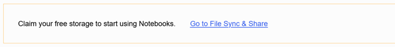
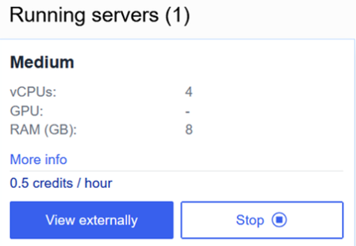
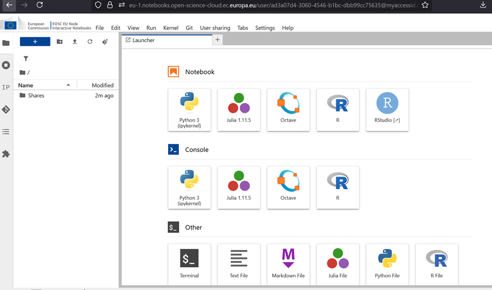
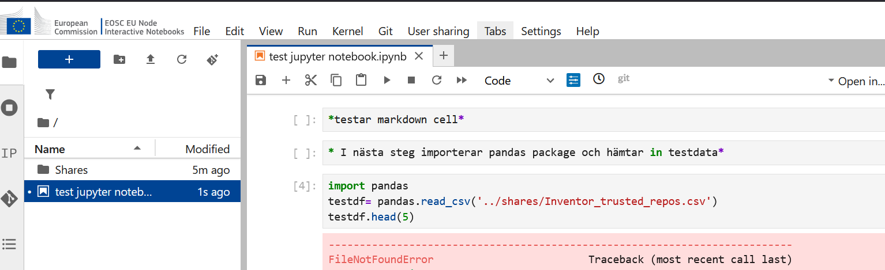

# Quick start user guide on how to access Jupyter notebooks at EOSC EU node

A guide for when you want to access and use Jupyter Notebooks at the EOSC EU node for the first time. With the EOSC EU node you get access to some basic resources and can work with a jupyter notebook using the resources in the EOSC virtual environment. Probably most suitable if you have smaller non-confidential data-sets and not super compute-intensive processing, i.e if you want to run some tests on transforming and visualising a smaller dataset (Mb range) or on a smaller subset of data before you perform more compute-intensive processing of larger datasets (Tb-Pb).

Step-by-step guide

As a KTH user you need to follow these steps to get started with Jupyter Notebooks in the EOSC EU Node

1- Go to:  https://open-science-cloud.ec.europa.eu/

2- Create an account - choose KTH Royal Institute of Technology from list and wait until you receive notice that your account is activated. (Note: this you only need to do the first time)

3- Log-in at the top right corner using your KTH-credentials

4- In the left menu under "Services" - click on "Interactive Notebooks"

5- At the upper part of the main space you can click on " Claim your free storage" and then you see a notice to the right that the "Order is submitted". (Note: this you only need to do the first time)

<figure markdown="span">
    { loading=lazy }
<figcaption>Upload button</figcaption>
</figure>

6- Once you received notification (at the top corner ) that your request was accepted, you can now select "Small" or "Medium" if you are KTH-Staff. If you are an academic faculty staff can also select "Big" which gives GPU access as welll. Click on one of the options for "server size" available by clicking on the blue button.  to get server access. (Note:  When you have accessed the service for the first time, the next time the blue button will read "start" instead)

<figure markdown="span">
    { loading=lazy }
<figcaption>VM sizes</figcaption>
</figure>

7- You will see a new box - "Running servers" Click on the option "View externally".

<figure markdown="span">
    { loading=lazy }
<figcaption>Running servers</figcaption>
</figure>

This will redirect you to the Jupyter Hub service. This can run on either one of two storage sites -recommended to select site one *

8- When redirected, you should be able to see a jupyter hub dashboard:

<figure markdown="span">
    { loading=lazy }
<figcaption>Dashboard</figcaption>
</figure>

9- Run for example a notebook and as you can see you get the same familiar error messages when you fail to get file path correct. Voila now you're ready to get back to swearing over regular errors instead of cursing the " easy access promise" on the main page -congrats you're in !

<figure markdown="span">
    { loading=lazy }
<figcaption>Notebook</figcaption>
</figure>

BOXED:
     * If you want to run your container with Sweden, select storage site number two.
    For further documentation, please see the EOSC documentation: https://docs.psnc.pl/display/EOSCUserGuides/Interactive+Notebooks
    For support on KTH research data services you can contact researchdata@kth.se, for detailed questions on how to use the EOSC-related services -please contact the EOSC Helpdesk with the support form when you are logged in at the EOSC EU Node portal https://open-science-cloud.ec.europa.eu/